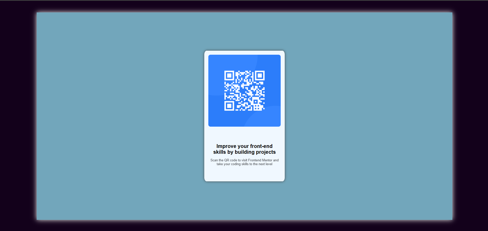
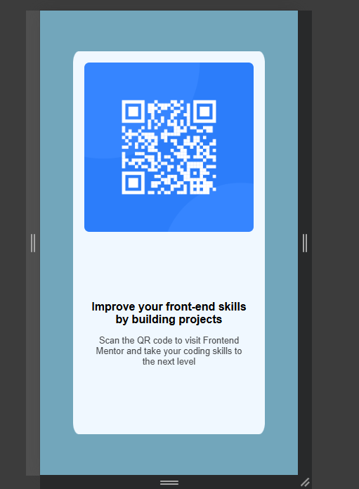

### Screenshot

 

### Links

- Solution URL: [Add solution URL here](https://your-solution-url.com)
- Live Site URL: [Add live site URL here](https://your-live-site-url.com)

## My process

  -started by html used nested divs for styling aligning and breaking stuff down into different sections for better control
  -then I wrote a separate css file and linked it
  -started to style it with desktop in mind but should've done mobile first
  -used media queries then i realized its easier to do mobile first approach

### Built with

- Semantic HTML5 markup
- CSS custom properties
- Flexbox
- Mobile-first workflow

### What I learned

I learned that you should start with mobile first approach when building a website

### Continued development

I can figure out the html and css part but i really want to focus on the backend part

### Useful resources
ws3schools.com

## Author

- Website - [Angel Kant](https://www.your-site.com)
- Frontend Mentor - [@angelassassin](https://www.frontendmentor.io/profile/angelassassin)